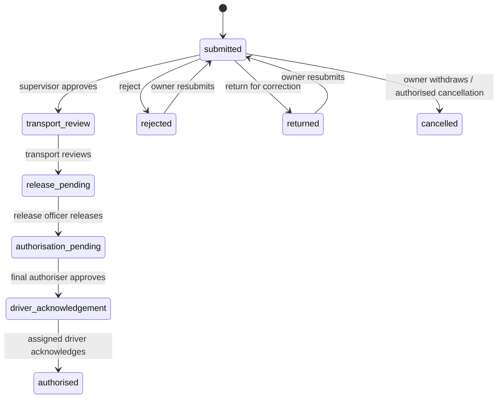
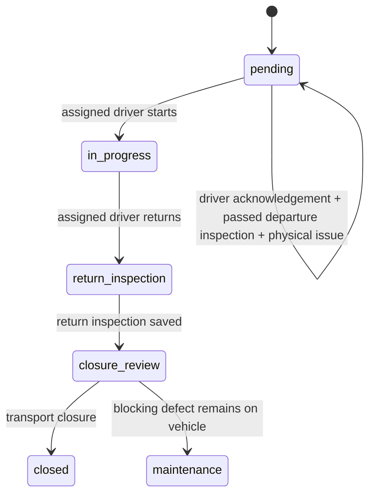

# GRN Fleet Role and Workflow Audit — 23 July 2026

## Scope and evidence

This audit compares the repository documentation and approved request against production and source code. Production was inspected read-only using `admin@kavangoeast.gov.na`; implementation and data tests use the isolated Neon child branch `br-icy-heart-as6s6kfy`. Production was not migrated or seeded.

The initial production data contained one login, two memberships, one role assignment, ten employees, no employee/login links, no driver profiles or licences, and two workflow definitions with no usable assigned-person routing. The production sidebar rendered links that the account could not use, while several dashboard pages had no page-level permission guard.

## Initial requirement audit and implemented status

| # | Requirement | Initial finding | Evidence | Status on this branch |
|---|---|---|---|---|
| 1 | User and role management | Partially implemented; accounts could exist without employees and duplicate assignments were possible | `src/app/api/admin/users`, `src/app/api/users/invite`, `src/db/schema/tenants.ts` | Implemented and integration-tested: employee link is mandatory, active tenant employee and role are validated before inserts, unique membership/assignment indexes added |
| 2–3 | Separate accounts for operational roles | Missing in production; only the named admin account was usable | Production DB read-only count; `src/seed/index.ts` | Implemented: 13 distinct accounts including platform and tenant administrators plus every operational role |
| 4 | Driver profiles, licences, verification, availability | Database model only/empty in production | `src/db/schema/people.ts`, production counts | Implemented: profile availability/verification metadata, verified licence history, end-of-allocation expiry validation, seed repair on rerun |
| 5 | Convert staff to driver | Missing/discoverability gap | Staff detail page and driver API | Implemented: staff detail action and tenant-scoped `POST /api/drivers` with audit event |
| 6 | Configurable approval routing | Database model only; steps had no assigned person or organisation criteria | `src/db/schema/workflows.ts`, `src/lib/workflow-engine.ts` | Implemented: tenant/scope/region/office/department criteria, assigned users, most-specific matching and admin routing UI/API |
| 7 | Real department/office relations | Partial; requests relied on free text | `src/db/schema/requests.ts`, request form/API | Implemented: request department/office FKs are derived from the linked employee; impersonation requires staff-manage permission |
| 8 | Permission enforcement | Broken/inconsistent across sidebar, pages and APIs | `src/components/layout/sidebar.tsx`, dashboard layout, multiple routes | Implemented centrally for navigation and server page entry; action buttons and APIs use role-specific permissions |
| 9–10 | Regions permission/API consistency | Broken; `/api/regions` and `/api/admin/regions` differed and admin routes returned 403 | Both region route trees and production requests | Implemented: one `/api/regions` API, tenant-view for reads, tenant-manage for mutations, duplicate routes removed |
| 11–12 | Idempotent seed and role test users | Partial; one admin was assigned several operational roles | `src/seed/index.ts` | Implemented and run repeatedly: no duplicate memberships, roles or licences; accounts link to employees, tenant and office |
| 13 | Regional and national workflow | Partial; one user could progress the workflow and assignment routing was absent | `src/lib/workflow-engine.ts`, approval API | Implemented: separate assigned people, separation of duty, next-user notification, rejection/return/resubmit and two scope definitions |
| 14 | Vehicle/driver conflicts | Partial/API-only and race-prone | allocation routes | Implemented: time-overlap checks plus PostgreSQL exclusion constraints; replacement is pre-issue, reasoned, versioned and audited |
| 15 | Mandatory inspections | Broken; empty inspection could pass and inspections auto-started/auto-closed trips | inspection API and trip routes | Implemented: active server template, every item, acknowledgements and required photos; critical failures create blocking defects |
| 16 | Driver acknowledgement, execution, fuel, odometer, offline | Partial and broken; trip log wrote user ID into employee FK, fuel did not verify assigned trip | trip/fuel/log APIs and offline sync | Implemented: assigned employee resolution, ordered trip gates, immutable odometer events, monotonic readings, client sync IDs and offline photo upload |
| 17 | Maintenance escalation | Partial; defects were saved but ownership/notification was inconsistent | inspection and maintenance code | Implemented: critical failure puts vehicle in maintenance, creates maintenance event and notifies maintenance users; close cannot make a blocked vehicle available |
| 18 | Notifications, documents, reports, audit | Partial; notification POST allowed unauthenticated/cross-tenant writes and workflow notification stopped at requester | notification API, workflow engine | Implemented security and next-assignee notification; material actions write audit events. Document snapshot schema warnings remain listed below |
| 19 | Tenant and role isolation | Broken in platform endpoints and several server pages | platform APIs, maintenance/staff/driver pages | Implemented: platform-admin-only tenant APIs, tenant-scoped page queries, second-tenant fixture and browser/API isolation assertions |
| 20 | Desktop/tablet/mobile | Partially implemented | responsive components and existing Playwright specs | Verified for role-scoped mobile requester navigation; screenshots and existing responsive suite retained |

## Role and permission matrix

| Role | Primary permissions/jobs | Explicitly excluded |
|---|---|---|
| Platform Super Administrator | Platform tenant list/onboarding, platform audit | Operational approval steps |
| Tenant Administrator | Users, roles, organisation, regions, audit/report administration | Transport review, release, authorisation, inspection |
| Transport Administrator | Requests review, allocation, fleet, driver administration, issue/close, fuel/report operations | Tenant/platform management, final authorisation |
| Requester | Create/view/withdraw own requests | Approval, allocation, other requesters’ records |
| Immediate Supervisor | Assigned supervisor approval | Own-request approval and later stages |
| Control Administrative Officer | Regional administrative release and inspection | Final authorisation |
| Deputy Director | Regional final authorisation | Release of the same request |
| Director | National release | National final authorisation |
| Chief Regional Officer | National/emergency final authorisation | Administrative release |
| Assigned Driver | Assigned trip acknowledgement, execution, logs and fuel | Fleet allocation, issue and closure |
| Inspector | Departure/return inspections | Allocation and closure |
| Maintenance Officer | Maintenance follow-up, inspection/fleet/fuel read | Approval routing and fuel administration |
| Tenant Auditor | Read/export audit, reports and operational history | Mutations |

## Approval-routing matrix

| Scope | Order | Action | Seeded responsible account | Separation rule |
|---|---:|---|---|---|
| Regional | 1 | Supervisor approval | `supervisor@kavangoeast.test` | Not requester |
| Regional | 2 | Transport review | `transport.admin@kavangoeast.test` | Not requester |
| Regional | 3 | Administrative release | `release.officer@kavangoeast.test` | Recorded for final-authoriser separation |
| Regional | 4 | Final authorisation | `regional.authoriser@kavangoeast.test` | Not release actor |
| Regional | 5 | Driver acknowledgement | `driver@kavangoeast.test` | Must be assigned allocation driver |
| National | 1–2 | Supervisor and transport review | Same functional accounts | Same rules |
| National | 3 | Director release | `national.release@kavangoeast.test` | Recorded for final-authoriser separation |
| National | 4 | CRO authorisation | `national.authoriser@kavangoeast.test` | Not release actor |
| National | 5 | Driver acknowledgement | `driver@kavangoeast.test` | Must be assigned allocation driver |

Definitions can be narrowed by region, office and department. The engine selects the most-specific active match, then the newest version.

## State machines

## Database and API changes

- Migration: `src/db/migrations/0011_role_workflow_foundations.sql`.
- New relations/fields: request organisation and idempotency, workflow criteria/assignee, driver availability/verification, trip acknowledgement, fuel sync ID.
- New constraints: membership, role assignment, organisation codes, workflow route/order, request/log/fuel idempotency, workflow action idempotency, vehicle and driver time-range exclusion.
- New APIs: `GET/PATCH /api/admin/workflows`, `POST /api/requests/:id/resubmit`.
- Consolidated API: `/api/regions`; `/api/admin/regions*` removed.
- Hardened APIs: platform tenants/onboarding, users/invites, allocations, trips, inspections, fuel, logs, notifications and maintenance.

## Test-account matrix

All development/E2E accounts use the configured seed password (default `changeme`) and are linked to active KERC employees and memberships.

| Account | Employee | Role |
|---|---|---|
| `admin@kavangoeast.gov.na` | KERC001 | Tenant Administrator |
| `platform.admin@grnfleet.test` | KERC014 | Platform Super Administrator |
| `transport.admin@kavangoeast.test` | KERC011 | Transport Administrator |
| `requester@kavangoeast.test` | KERC002 | Requester / Programme Owner |
| `supervisor@kavangoeast.test` | KERC003 | Immediate Supervisor |
| `release.officer@kavangoeast.test` | KERC004 | Control Administrative Officer |
| `regional.authoriser@kavangoeast.test` | KERC005 | Deputy Director |
| `national.release@kavangoeast.test` | KERC006 | Director |
| `national.authoriser@kavangoeast.test` | KERC007 | Chief Regional Officer |
| `driver@kavangoeast.test` | KERC008 | Assigned Driver |
| `inspector@kavangoeast.test` | KERC012 | Inspector |
| `maintenance@kavangoeast.test` | KERC013 | Maintenance Officer |
| `auditor@kavangoeast.test` | KERC010 | Tenant Auditor |

## Validation evidence

- TypeScript: pass.
- ESLint: pass.
- Unit suite: 72/72 pass.
- Integration suite on child database: authentication, documents and permission integrity pass after seed synchronization.
- Migration: applied successfully to child database.
- Seed: repeated successfully; 2 tenants, 13 users, 13 linked employees, 2 verified driver licences, 15 system roles, 10 assigned workflow steps, zero duplicate memberships.
- Browser E2E: separate-role access/isolation test passes; complete regional workflow passes through request, approval users, allocation, inspection, acknowledgement, issue, execution, idempotent fuel/log sync, return, critical defect escalation and closure with database assertions.

## Known limitations and deferred items

- Production remains on the original schema/data until this pull request is reviewed and deployed.
- E-mail/SMS delivery depends on external provider credentials; in-app notifications are verified.
- Offline inspection sync stores browser `File` objects in IndexedDB. Browser/platform storage limits remain device-specific.
- Existing legacy E2E files that authenticate only as the tenant admin do not represent the approved separation-of-duty workflow; the new multi-role scenario is the authoritative workflow test and the older scenarios should be incrementally refactored.
- No secrets are added to source control. Database credentials are supplied only as process environment values during isolated validation.
